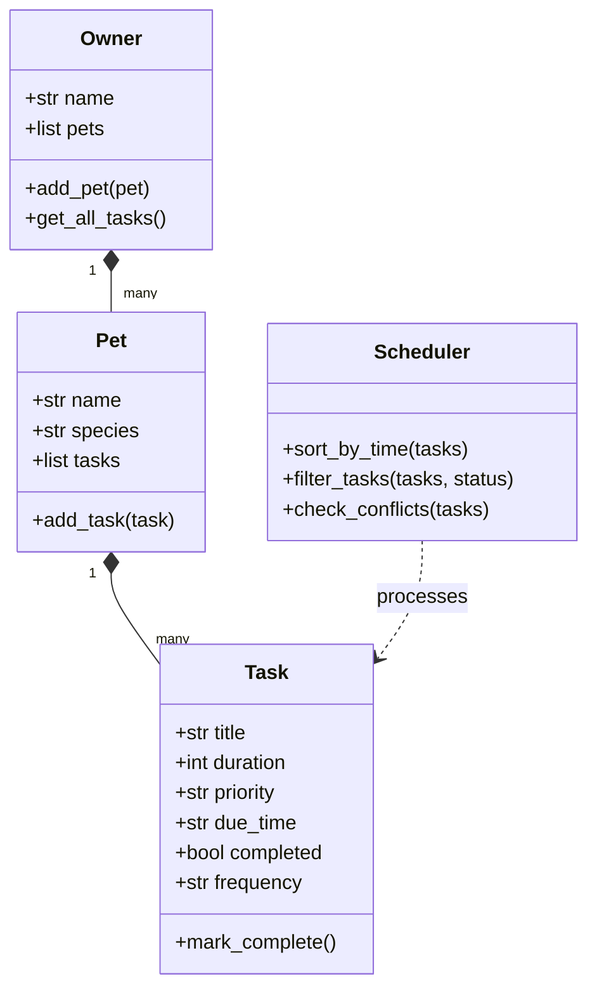

# System Architecture

This document describes the architectural patterns and data flow of the PawPal+ application.

## Overview
The application is structured into two primary layers to maintain a strict separation of concerns:
1. **Logic Layer (`pawpal_system.py`)**: A pure Python library containing the OOP models representing the core entities (Owner, Pet, Task) and the Scheduler. This layer is fully testable and runnable independently of any UI.
2. **UI Layer (`app.py`)**: A Streamlit web application that provides the visual interface. It consumes the Logic Layer classes, binds UI inputs to class operations, and manages application memory across reruns.

## Core Abstractions

## Data Flow
1. **Adding a Pet**: User enters pet info in `app.py` -> UI calls `Owner.add_pet()` -> New `Pet` instance is appended to the Owner's pets list.
2. **Scheduling a Task**: User adds task details in `app.py` -> UI calls `Pet.add_task()` -> A `Task` instance is added to the Pet.
3. **Generating Schedule**: User clicks generate schedule in `app.py` -> UI retrieves all tasks via `Owner.get_all_tasks()` -> Passes tasks to `Scheduler` -> Scheduler sorts, filters, checks conflicts, and returns the sorted plan -> UI renders plan.
