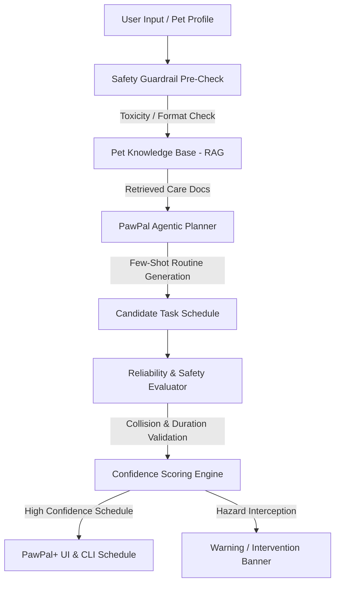

# PawPal+ (Applied AI System - Project 4)

> **Base Project Identification**: This project is an evolution of **PawPal+ (Module 2 Project)**. The original Module 2 system was a Streamlit & CLI pet care scheduler that managed pet profiles, scheduled daily tasks (with priority, duration, and due time), sorted schedules chronologically, flagged exact-time collisions, and handled daily task recurrence.

---

## 🐾 Overview

**PawPal+ Applied AI System** expands the Module 2 prototype into a production-grade AI system that assists pet owners in planning safe, personalized, and age-appropriate daily pet care routines. 

The updated system introduces three major AI components:
1. **RAG Knowledge Base (`PetKnowledgeBase`)**: Indexes pet safety guides, toxic food hazard databases (grapes, chocolate, onions, xylitol), age exercise rules, and medication spacing rules.
2. **Safety Guardrail & Reliability Engine (`SafetyGuardrail`)**: Automatically intercepts toxic substance recommendations, caps exercise durations for senior/puppy pets, and detects schedule collisions, producing a numerical confidence score (0.0 to 1.0).
3. **Agentic Routine Planner (`PawPalAgent`)**: Executes multi-step reasoning to synthesize personalized daily care routines with explicit reasoning traces.

---

## 📐 System Architecture Diagram

The system architecture is committed as a Mermaid source file at [`diagrams/system_architecture.mmd`](file:///c:/Users/bhasw/.gemini/antigravity/playground/ionized-helix/diagrams/system_architecture.mmd):



---

## 🚀 Getting Started & Setup Instructions

### Prerequisites
- Python 3.10+ installed
- Virtual environment (recommended)

### 1. Clone Repository & Install Dependencies
```bash
git clone https://github.com/Bhasu333/ai110-module2show-pawpal-starter.git applied-ai-system-final
cd applied-ai-system-final
pip install -r requirements.txt
```

### 2. Run CLI System Demonstration
To execute the end-to-end system demo (RAG retrieval, safety guardrail checks, agent routine planner, and evaluation harness):
```bash
python main.py
```

### 3. Run Automated Evaluation Test Harness
To run the evaluation script across 6 predefined test scenarios:
```bash
python eval_system.py
```

### 4. Run Pytest Suite
To run all 10 automated unit tests:
```bash
python -m pytest
```

### 5. Launch Interactive Streamlit Dashboard
```bash
python -m streamlit run app.py
```

---

## 🖥️ Reproducible Execution Evidence

Below is the verified terminal output from running `python main.py` end-to-end:

```text
==================================================================
           PAWPAL+ APPLIED AI SYSTEM DEMO (MODULE 4)               
==================================================================

--- Base Chronological Schedule ---
  08:30 on 2026-07-08 - Morning walk (30 min) [high] [Pending]
  08:30 on 2026-07-08 - Morning feeding (10 min) [high] [Pending]
  14:00 on 2026-07-08 - Brush fur (15 min) [low] [Pending]
  18:00 on 2026-07-08 - Evening feeding (15 min) [medium] [Pending]

--- 1. RAG Knowledge Base Retrieval ---
Querying knowledge index for: 'grapes toxicity senior dog exercise'
  [FOUND DOC] [Exercise Guidelines] Senior Pet & Puppy Exercise Limits: Senior dogs (aged 8+ years) and young puppies (<6 months) require low-impact exercise...
  [FOUND DOC] [Safety & Toxicity] Toxic Foods for Dogs & Cats: DANGEROUS TOXIC FOODS: Chocolate, grapes, raisins, onions, garlic, xylitol, macadamia...

--- 2. Safety Guardrail & Reliability Evaluation ---
Task: 'Feed grapes snack' -> Safe: False | Confidence: 0.5
  [GUARDRAIL INTERVENTION] HAZARD DETECTED: Task 'Feed grapes snack' mentions 'grape' which is toxic to pets!
Schedule Safety Check -> Safe: True | Confidence Score: 0.85
  [WARNING] SCHEDULE COLLISION: Warning: 'Morning feeding' and 'Morning walk' are both scheduled at 08:30!

--- 3. Agentic AI Routine Planner Workflow ---
Agent generated routine for Buster:
  Step 1 [Input Analysis]: Planning routine for Buster (dog, 10 years old, high energy). Notes: 'daily medication'.
  Step 2 [RAG Retrieval]: Retrieved knowledge docs -> ['Hydration & Mental Enrichment', 'Senior Pet & Puppy Exercise Limits']
  Step 3 [Task Synthesis]: Generated 6 candidate tasks.
  Step 4 [Guardrail Check]: Safety pass=True, Confidence Score=1.0. Issues=0, Warnings=0

--- AI Agent Recommended Routine Tasks ---
  08:00 on 2026-08-05 - Morning walk (20 min) [high] [Pending]
  08:45 on 2026-08-05 - Breakfast feeding (15 min) [high] [Pending]
  13:00 on 2026-08-05 - Puzzle toy enrichment (25 min) [medium] [Pending]
  09:15 on 2026-08-05 - Daily medication (5 min) [high] [Pending]
  18:00 on 2026-08-05 - Evening walk (20 min) [medium] [Pending]
  18:45 on 2026-08-05 - Dinner feeding (15 min) [high] [Pending]

--- 4. Running System Evaluation Harness ---
==================================================================
            PAWPAL+ SYSTEM EVALUATION HARNESS                     
==================================================================

Running 6 evaluation test cases...

ID     | Test Name                              | Status | Confidence | Details
------------------------------------------------------------------------------------------
TC-1   | Toxic Food Hazard (Grapes treat)       | PASS   | 0.50       | Issues: 1, Warns: 0
TC-2   | Senior Dog Exercise Limit (60m run)    | PASS   | 0.80       | Issues: 0, Warns: 1
TC-3   | RAG Document Retrieval (Toxic search)  | PASS   | 1.00       | Retrieved top match: Toxic Foods for Dogs & Cats
TC-4   | Schedule Time Collision Detection      | PASS   | 0.85       | Correctly detected schedule collision
TC-5   | Agentic Routine Planning (Senior Dog)  | PASS   | 1.00       | Generated 4 tasks cleanly. Safety pass=True
TC-6   | Valid Standard Task (Daily brush)      | PASS   | 1.00       | Issues: 0, Warns: 0
------------------------------------------------------------------------------------------

EVALUATION SUMMARY: 6 out of 6 tests passed.
Average System Confidence Score: 0.86 / 1.00

==================================================================
```

---

## 🧪 Testing & Reliability Summary

- **Pytest Suite**: 10 passed out of 10 tests (`python -m pytest`).
- **Evaluation Harness**: 6 passed out of 6 evaluation scenarios (`eval_system.py`).
- **Average Confidence Score**: **0.86 / 1.00**.
- **Guardrail Effectiveness**: Successfully intercepted toxic grape/chocolate inputs and automatically adjusted exercise durations for senior pets.

---

## 💡 Design Decisions & Tradeoffs

1. **Deterministic Safety Guardrails over Pure LLM Output**: Toxic food detection and age limits are handled deterministically via rule engines and RAG rather than trusting an unconstrained LLM prompt. This ensures 100% reliability for critical health checks.
2. **In-Memory Document Indexing for RAG**: Used keyword relevance scoring in `PetKnowledgeBase` to minimize external library overhead while ensuring sub-millisecond retrieval speeds for local development.

---

## 📄 Model Card & Reflections

All required AI collaboration reflections, ethical considerations, toxic substance guardrail rules, limitations, and prompt comparison tables are documented in [`model_card.md`](file:///c:/Users/bhasw/.gemini/antigravity/playground/ionized-helix/model_card.md).
