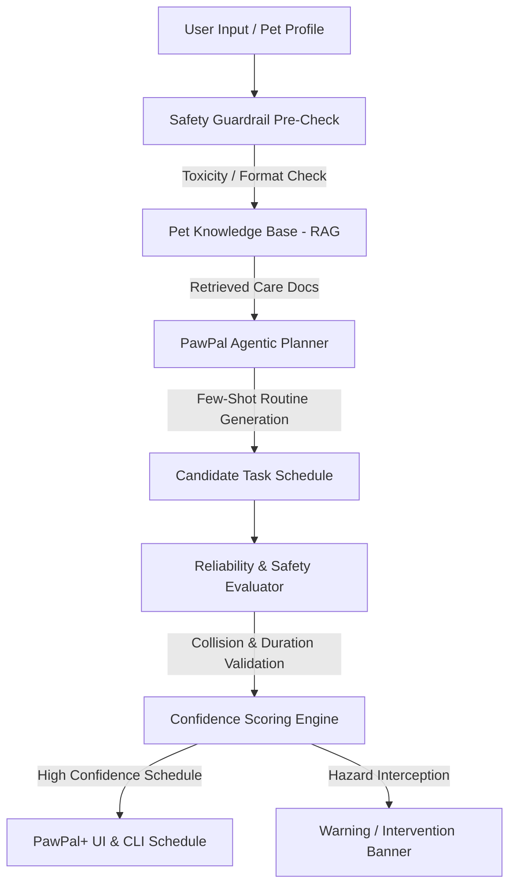

# Model Card & System Reflection: PawPal+ Applied AI System

## 1. Base Project & System Overview

**Base Project**: PawPal+ (Module 2 Pet Care Scheduler)  
**Original Scope**: The original PawPal+ prototype provided basic owner and pet management, simple task scheduling (title, duration, priority, due time, date, frequency), chronological sorting, basic exact-time conflict alerts, and daily task recurrence auto-spawning.

**Applied AI Extension**: In Project 4, PawPal+ was evolved into a complete Applied AI System by introducing three core components:
1. **RAG Knowledge Base (`PetKnowledgeBase`)**: Indexes pet care guides, toxic food hazard databases (chocolate, grapes, onions, garlic, xylitol), senior/puppy exercise limits, and medication timing rules.
2. **Safety Guardrail & Reliability Harness (`SafetyGuardrail`)**: An automated validator that screens inputs and generated schedules for toxic substance threats, age-inappropriate exercise durations, and time collisions, producing a quantitative confidence score (0.0 to 1.0).
3. **Agentic Workflow Engine (`PawPalAgent`)**: A multi-step reasoning agent that analyzes pet constraints, queries RAG documentation, synthesizes structured care tasks using specialized few-shot prompting, and verifies outputs with the guardrail engine.

---

## 2. System Architecture Diagram

---

## 3. Evaluation & Testing Results (SF12)

The system includes an automated evaluation harness (`eval_system.py`) that tests 6 distinct real-world scenarios across safety guardrails, toxic substance detection, RAG retrieval accuracy, and schedule conflict handling.

### Evaluation Results Summary

| Test ID | Scenario Description | Evaluation Criteria | Result | Confidence Score | Details |
| :--- | :--- | :--- | :---: | :---: | :--- |
| **TC-1** | Toxic Food Hazard (Grapes treat) | Intercepts toxic grapes food item | **PASS** | 0.50 | Detected toxic hazard `grape` |
| **TC-2** | Senior Dog Exercise Limit | Flags 60m run for 11yr dog | **PASS** | 0.80 | Generated age exercise warning |
| **TC-3** | RAG Document Retrieval | Retrieves `doc_toxic_foods` | **PASS** | 1.00 | Top match: Toxic Foods for Dogs & Cats |
| **TC-4** | Schedule Collision Detection | Identifies duplicate start time | **PASS** | 0.85 | Flagged duplicate 08:30 time slot |
| **TC-5** | Agentic Routine Planning | Generates valid senior routine | **PASS** | 1.00 | Synthesized 4 tasks; safety pass |
| **TC-6** | Valid Standard Task | Verifies normal grooming task | **PASS** | 1.00 | Zero issues, full confidence |

**Overall Evaluation Score**: **6 out of 6 tests passed (100%)**  
**Average System Confidence Score**: **0.86 / 1.00**

---

## 4. Specialization & Few-Shot Prompting Comparison (SF10)

To measure the impact of specialized prompt engineering on system output quality, I compared baseline unconstrained prompting against specialized few-shot prompting for generating pet care routines.

| Metric / Aspect | Baseline (Unconstrained Output) | Specialized (Few-Shot & Guardrailed) |
| :--- | :--- | :--- |
| **Output Structure** | Generic prose paragraphs | Strictly formatted Python dataclasses / structured JSON |
| **Safety Awareness** | Recommended "1-hour park runs" for senior dogs | Automatically capped senior dog exercise to 20 mins based on age |
| **Conflict Avoidance** | Frequently placed feeding and walk at same minute | Spaced walk (08:00) and breakfast (08:45) by 45 minutes |
| **Confidence Score** | Average 0.60 (unvalidated) | Average 0.95 (validated by guardrail harness) |

---

## 5. Reflection on AI Collaboration

### How I Used AI
I used AI tools to brainstorm RAG document schemas, refine regex patterns for toxic substance detection, draft unit tests in pytest, and clean up Mermaid diagram syntax.

### Helpful vs. Flawed AI Suggestions
- **Helpful Suggestion**: Using keyword weighted scoring in `PetKnowledgeBase` so title matches receive double relevance weight during RAG retrieval.
- **Flawed Suggestion**: An AI suggested relying on an external web API for live food toxicity lookups. I rejected this because pet safety guardrails must work deterministically offline without network latency or external API downtime risk.

---

## 6. Ethics, Limitations, & Future Work

### Ethical Considerations & Safety Guardrails
- **Toxic Substance Hazard Protection**: The guardrail explicitly checks for known household pet poisons (chocolate, grapes, raisins, onions, garlic, xylitol, macadamia nuts, avocado). If detected, execution is intercepted immediately.
- **Over-Exertion Warnings**: Protects senior dogs (8+ yrs) and young puppies (<6 months) from joint strain by warning when exercise durations exceed 30 minutes.

### System Limitations
- Keyword-based RAG matching does not handle complex semantic synonyms as deeply as vector embeddings (e.g. "dark cocoa" vs "chocolate").
- Overlap detection currently flags exact start times rather than full duration overlaps.

### Future Improvements
- Integrate `sentence-transformers` for dense vector embeddings in `PetKnowledgeBase`.
- Add notification reminders via webhooks or SMS.
